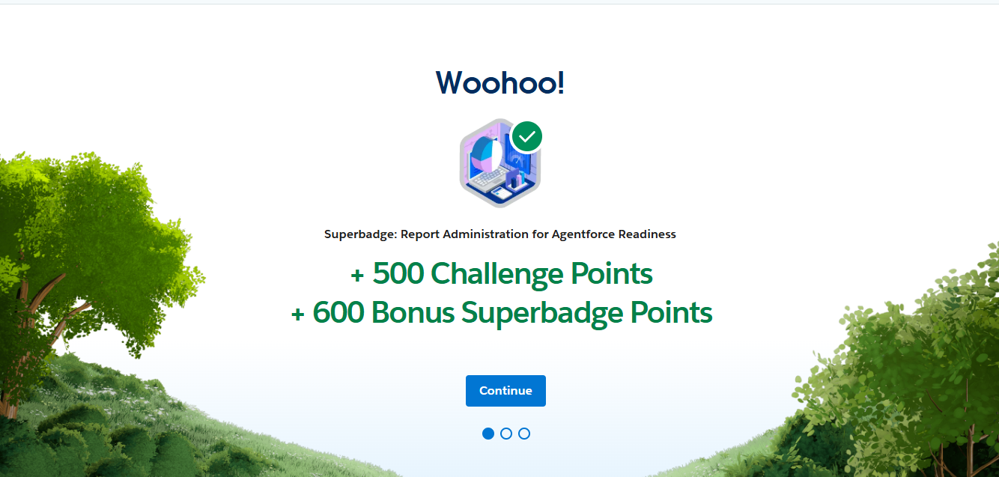
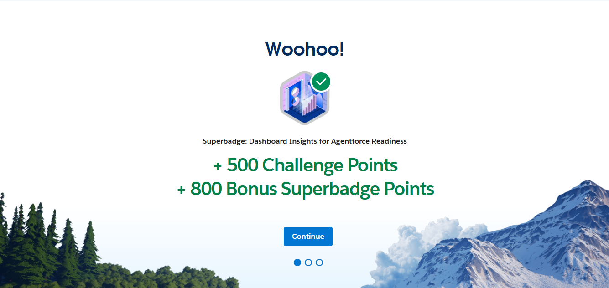

# 📜 Certifications

This repository holds my professional certificates and credentials, with quick-access badges and verification links. Each entry has a one-line summary of what it covers.

## ✅ Quick Access

> Tip: Click a badge to open the credential. The Coursera and OSHA certificates are PDFs in this repo; the Salesforce superbadges link to Trailhead.

---

## 📄 Certificate Index

| Certificate | Issuer / Platform | Issued | Expires | Verify |
|---|---|---:|---:|---|
| Google Data Analytics (Professional Certificate) | Google · Coursera | 2023-12-28 | N/A | https://coursera.org/verify/professional-cert/XN9RSCLFQ7HS |
| Supply Chain Management (Specialization) | Rutgers University · Coursera | 2025-03-16 | N/A | https://coursera.org/verify/specialization/7AZ8IF5EPC33 |
| Introduction to Business (Specialization) | UCI Division of Continuing Education · Coursera | 2024-11-01 | N/A | https://coursera.org/verify/specialization/26P3GRJURKPB |
| Career Success (Specialization) | UC Irvine · Coursera | 2024-12-24 | N/A | https://coursera.org/verify/specialization/Y94B8WHNGFWC |
| Forklift Operator Certified | National Forklift Foundation (NFF) | 2024-09-03 | 2027-09-03 | Certificate ID: NFF-1725382714-2368-96083 |
| Report Administration for Agentforce Readiness (Superbadge) | Salesforce · Trailhead | 2026-08 | N/A | https://trailhead.salesforce.com/content/learn/superbadges/superbadge_reports_admin_for_agentforce_readiness_sbu |
| Dashboard Insights for Agentforce Readiness (Superbadge) | Salesforce · Trailhead | 2026-08 | N/A | https://trailhead.salesforce.com/content/learn/superbadges/dashboard_insights_for_agentforce_readiness_superbadge_unit |

---

## 📝 What Each Covers

- **Google Data Analytics:** Eight-course Google professional certificate in the data analysis workflow, from preparing and processing data through analysis and sharing. Hands-on work in spreadsheets, SQL, Tableau, and R, closing with a capstone case study.
- **Supply Chain Management (Rutgers):** Five-course Rutgers specialization covering the fundamentals of supply chain logistics, operations, planning, and sourcing, with a capstone in supply chain management strategy. Focused on the practices companies use to run a global supply network.
- **Introduction to Business (UCI):** Three-course UCI specialization in management and strategic planning, finance fundamentals, and digital marketing. Covered financial statements, cash flow, and expense management alongside people management and leadership, with graded projects including a strategic planning agenda and a cash-flow analysis.
- **Career Success (UC Irvine):** Ten-course UC Irvine specialization covering finance for non-financial roles, basic data analysis, project management, and business writing, plus communication, negotiation, management, and problem-solving. Ends with a capstone project.
- **Forklift Operator (NFF):** Powered industrial truck operator certification meeting OSHA 29 CFR 1910.178, awarded on completion of course requirements and an on-site practical evaluation. Credential ID NFF-1725382714-2368-96083, valid through September 2027.
- **Report Administration for Agentforce Readiness:** Intermediate Salesforce admin superbadge covering report folders and report access, configuring reports for data-quality insight, and building tabular, matrix, and joined reports with customized charts. Units cover case backlog and resolution, case impact on sales opportunities, and deal growth analysis.
- **Dashboard Insights for Agentforce Readiness:** Intermediate Salesforce admin superbadge using Lightning Dashboard Builder: configure a data-quality analysis dashboard, redesign an executive readiness dashboard for readability and accessibility, and set folder sharing and access controls. Covers dashboard component types and access management.

---

## ⚡ Salesforce Superbadges

Completion records for the two Agentforce-readiness superbadges, earned August 2026. Both link to the Trailhead superbadge page for verification.

### Report Administration for Agentforce Readiness

[View superbadge on Trailhead](https://trailhead.salesforce.com/content/learn/superbadges/superbadge_reports_admin_for_agentforce_readiness_sbu)

### Dashboard Insights for Agentforce Readiness

[View superbadge on Trailhead](https://trailhead.salesforce.com/content/learn/superbadges/dashboard_insights_for_agentforce_readiness_superbadge_unit)

---

## Author

**Sawandi Kirby**

Data Analytics & Business Intelligence  
Benchline Analytics - Data intelligence for organizations that mean business.

- GitHub: https://github.com/visualkirby
- LinkedIn: https://linkedin.com/in/sawandi-kirby
- Kaggle: https://kaggle.com/sawandikirby
